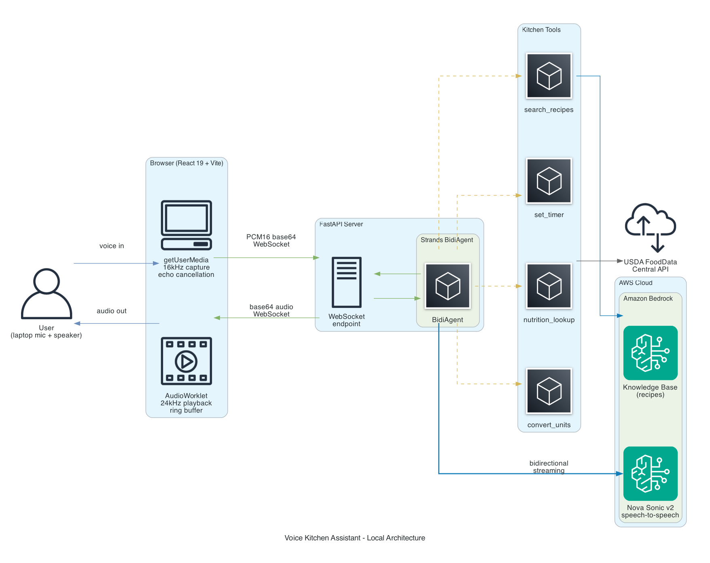
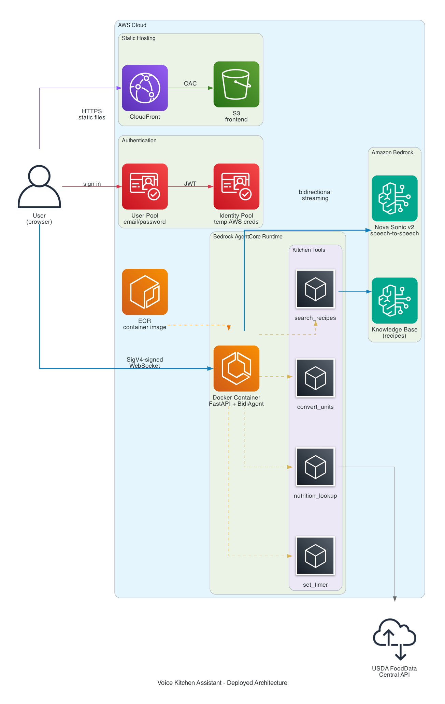

# Family Recipe Assistant - Voice Edition

A real-time voice agent that uses **Strands BidiAgent** and **Amazon Nova Sonic v2** for bidirectional audio streaming with tool use. Search your family recipes, look up nutrition, set cooking timers, and convert units - all by voice.

Built as a companion demo for the blog post: [Bi-directional Voice-Controlled Recipe Assistant with Nova Sonic v2](https://darryl-ruggles.cloud/bi-directional-voice-controlled-recipe-assistant-with-nova-sonic-2/)

## What It Does

Talk to a kitchen assistant that can:

- **Search recipes** by voice ("find me a quick pasta recipe") via Bedrock Knowledge Base
- **Set cooking timers** ("set a timer for 12 minutes for the pasta")
- **Look up nutrition** ("how many calories in a cup of rice?") via USDA FoodData Central
- **Convert units** ("convert 2 cups to milliliters" or "what is 350 fahrenheit in celsius?")
- **Handle interruptions** - change your mind mid-sentence and the agent adapts

## Architecture

**Local mode:**



**Deployed mode:**



## Two Ways to Run

**Local mode** - run entirely on your machine, no AWS infrastructure needed beyond Bedrock model access. Good for development and testing.

**Deployed mode** - container on AgentCore Runtime with S3/CloudFront frontend and Cognito auth. The browser connects directly to AgentCore via SigV4-signed WebSocket.

## Prerequisites

- **Python 3.13+** (3.12 minimum for Nova Sonic)
- **Node.js 18+** for the Vite frontend dev server
- **AWS account** with Bedrock model access enabled for Nova Sonic v2
- **PortAudio** system library (build dependency of `strands-agents[bidi-all]`):
  - macOS: `brew install portaudio`
  - Ubuntu/Debian: `sudo apt install portaudio19-dev`
- **uv** for Python dependency management: `curl -LsSf https://astral.sh/uv/install.sh | sh`

## Setup

```bash
# Clone the repo
git clone https://github.com/RDarrylR/serverless-family-recipes-bidirectional-nova-sonic.git
cd serverless-family-recipes-bidirectional-nova-sonic

# Install dependencies
uv sync
make install-frontend

# Configure AWS (must have Nova Sonic v2 access in your region)
export AWS_REGION=us-east-1

# Optional: USDA API key for nutrition lookups (DEMO_KEY works for testing)
export USDA_API_KEY=your_key_here

# Optional: Bedrock Knowledge Base ID for recipe search
export BEDROCK_KB_ID=your_kb_id_here

# Optional: change the voice (tiffany, amy, or puck - must be lowercase)
export NOVA_SONIC_VOICE=tiffany
```

## Running Locally

The browser-based frontend uses the Web Audio API for echo cancellation, so you can use laptop speakers and mic directly - no headset required.

```bash
# Terminal 1: Start the WebSocket server
make serve

# Terminal 2: Start the Vite dev server
make serve-frontend
```

Open [http://localhost:5173](http://localhost:5173), click the microphone button, and start talking.

In local mode, the Vite dev server proxies WebSocket connections to the local FastAPI server - no authentication required.

## Deploying to AWS

The deployed architecture uses AgentCore Runtime (container), CloudFront + S3 for the frontend, and Cognito for authentication. The browser connects directly to AgentCore via SigV4-signed WebSocket - no Lambda or API Gateway in the path.

**Additional prerequisites:**

- **Terraform** for infrastructure provisioning
- **Docker** for building the container image
- **AWS CLI v2** with `bedrock-agentcore-control` plugin

**Steps:**

```bash
# 1. Create terraform.tfvars from the example template
cp infrastructure/terraform.tfvars.example infrastructure/terraform.tfvars
# Edit terraform.tfvars: set knowledge_base_id to your Bedrock KB ID

# 2. Provision infrastructure (S3, CloudFront, Cognito, ECR)
make plan
make apply

# 3. Build and push the container image
make docker-build
make docker-push

# 4. Create the AgentCore runtime (first time only)
make create-agent

# 5. Update terraform.tfvars with agent_runtime_arn from step 4
# 6. Re-apply Terraform to create Cognito IAM policy with the runtime ARN
make apply

# 7. Generate frontend .env from Terraform outputs
make setup-env

# 8. Build and deploy frontend to S3
make deploy-frontend

# 9. Create a Cognito user
aws cognito-idp admin-create-user \
  --user-pool-id <pool-id> \
  --username <email> \
  --user-attributes Name=email,Value=<email> Name=email_verified,Value=true \
  --profile blog_admin
```

For subsequent deploys (code changes only):

```bash
make deploy-agent     # Rebuild container + update AgentCore runtime
make deploy-frontend  # Rebuild React app + sync to S3
```

**Post-deploy:** Verify the AgentCore runtime role has the correct Bedrock permissions. The model ARN for Nova Sonic v2 is `amazon.nova-2-sonic-v1:0` - see the IAM gotcha in the troubleshooting section below.

## Project Structure

```
bidir_streaming/
├── src/
│   ├── server.py             # WebSocket server (FastAPI, local + container)
│   ├── config.py             # Model config, system prompt
│   ├── Dockerfile            # ARM64 container for AgentCore
│   ├── requirements.txt      # Container pip dependencies
│   └── tools/
│       ├── recipe_search.py    # Bedrock KB retrieval
│       ├── set_timer.py        # Async cooking timer
│       ├── nutrition_lookup.py # USDA FoodData Central
│       └── unit_converter.py   # Measurement conversions
├── frontend/                 # Browser voice UI (React 19 + Vite)
│   ├── src/
│   │   ├── App.jsx              # Root component (auth wrapper)
│   │   ├── auth.js              # Cognito sign-in/sign-up/sign-out
│   │   ├── aws-credentials.js   # Exchange JWT for temp AWS credentials
│   │   ├── websocket-presigned.js # SigV4 presign AgentCore WebSocket URL
│   │   ├── contexts/
│   │   │   └── AuthContext.jsx    # Cognito auth state provider
│   │   ├── components/
│   │   │   ├── VoiceChat.jsx      # Mic button, status, transcript display
│   │   │   └── AuthScreen.jsx     # Sign-in form (deployed mode)
│   │   ├── hooks/
│   │   │   ├── useVoiceSession.js   # WebSocket lifecycle + message routing
│   │   │   ├── useAudioCapture.js   # Mic capture (16kHz, echo cancellation)
│   │   │   └── useAudioPlayback.js  # AudioWorklet playback (24kHz)
│   │   └── audio/
│   │       ├── audioUtils.js          # PCM16/Float32/base64 conversions
│   │       └── audio-player-processor.js  # AudioWorklet 60s ring buffer
│   ├── .env.example          # Template for deployed mode env vars
│   ├── package.json
│   ├── vite.config.js
│   └── index.html
├── infrastructure/           # Terraform modules
│   └── modules/
│       ├── bedrock/          # IAM role for local dev (Bedrock access)
│       ├── storage/          # S3 frontend bucket
│       ├── auth/             # Cognito user pool + identity pool
│       ├── cdn/              # CloudFront distribution (S3 origin)
│       └── container/        # ECR repository + AgentCore IAM role
├── diagrams/                # Architecture diagrams (.png)
├── pyproject.toml            # uv project config
└── Makefile                  # Common commands
```

## Available Make Commands

| Command | Description |
|---------|-------------|
| **Local dev** | |
| `make serve` | Run the WebSocket server for browser frontend |
| `make serve-frontend` | Run the Vite dev server (localhost:5173) |
| `make install-frontend` | Install frontend npm dependencies |
| `make init` | Install Python dependencies |
| `make lint` | Run ruff linter |
| `make fmt` | Format code with ruff |
| **Infrastructure** | |
| `make plan` | Terraform plan |
| `make apply` | Terraform apply |
| **Deployment** | |
| `make docker-build` | Build ARM64 Docker image for AgentCore |
| `make docker-push` | Push image to ECR |
| `make create-agent` | Create AgentCore runtime (first time only) |
| `make deploy-agent` | Build, push, and update AgentCore runtime |
| `make agent-status` | Check AgentCore runtime status |
| `make deploy-frontend` | Build React app + S3 sync + CloudFront invalidation |
| `make setup-env` | Generate frontend .env from Terraform outputs |

## Troubleshooting

| Issue | Solution |
|-------|----------|
| Audio bunched together (no pauses) | Client-side AudioWorklet uses a 60-second ring buffer with overflow protection. If audio still sounds rushed, check `audio-player-processor.js` buffer size |
| Nova Sonic silently ignores audio | **IAM model ID gotcha**: The foundation model ARN is `amazon.nova-2-sonic-v1:0`, not `amazon.nova-sonic-v2`. If your IAM policy uses the wrong model ID pattern, the BidiAgent connects but the model silently fails to process audio. Check the IAM policy on your AgentCore runtime role |
| awscrt traceback on disconnect | Cosmetic - AWS CRT cancelled-future race condition on session close. Harmless, cannot be suppressed |
| No logs in CloudWatch | The container needs `aws-opentelemetry-distro` and the `opentelemetry-instrument` CMD wrapper for log capture |
| Browser mic permission denied | Click the lock icon in the URL bar and allow microphone access |
| Session cuts off at 8 min | Nova Sonic v2 limit - restart the session |
| PortAudio not found | Install with `brew install portaudio` (macOS) or `apt install portaudio19-dev` (Linux). Build dependency of `strands-agents[bidi-all]` |
| WebSocket connection refused (local) | Make sure `make serve` is running on port 8000 |
| WebSocket connection refused (deployed) | Check Cognito credentials, AgentCore runtime status (`make agent-status`), and IAM permissions on the Cognito identity pool role |

## Future: Combining with the Text-Based Assistant

This voice assistant and the [text-based Serverless Recipe Assistant](https://darryl-ruggles.cloud/serverless-recipe-assistant-with-agentcore-and-strands/) share the same Bedrock Knowledge Base and similar tool implementations, but have separate infrastructure and deployment pipelines. The plan is to merge them into a single app with both input modes - text chat via SSE/Lambda and voice via WebSocket/AgentCore - behind a single CloudFront distribution with shared Cognito auth. See the "Converging Voice and Text" section in the [blog post](https://darryl-ruggles.cloud/nova-2-sonic-bi-directional-voice-controlled-family-recipe-assistant/) for details.

## Related

- [Serverless Recipe Assistant](https://darryl-ruggles.cloud/serverless-recipe-assistant-with-agentcore-and-strands/) - The text-based version this extends
- [Strands BidiAgent docs](https://strandsagents.com/latest/documentation/docs/user-guide/concepts/bidirectional-streaming/quickstart/)
- [Nova Sonic v2 docs](https://docs.aws.amazon.com/nova/latest/nova2-userguide/sonic-integrations.html)
